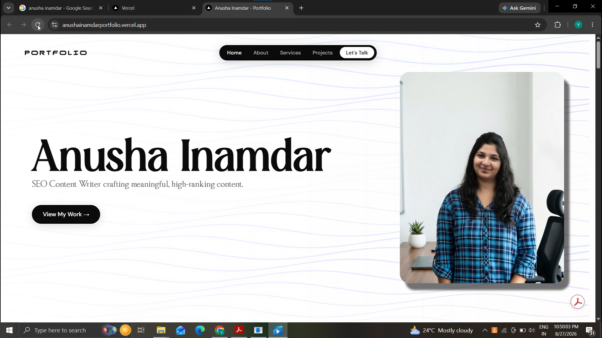
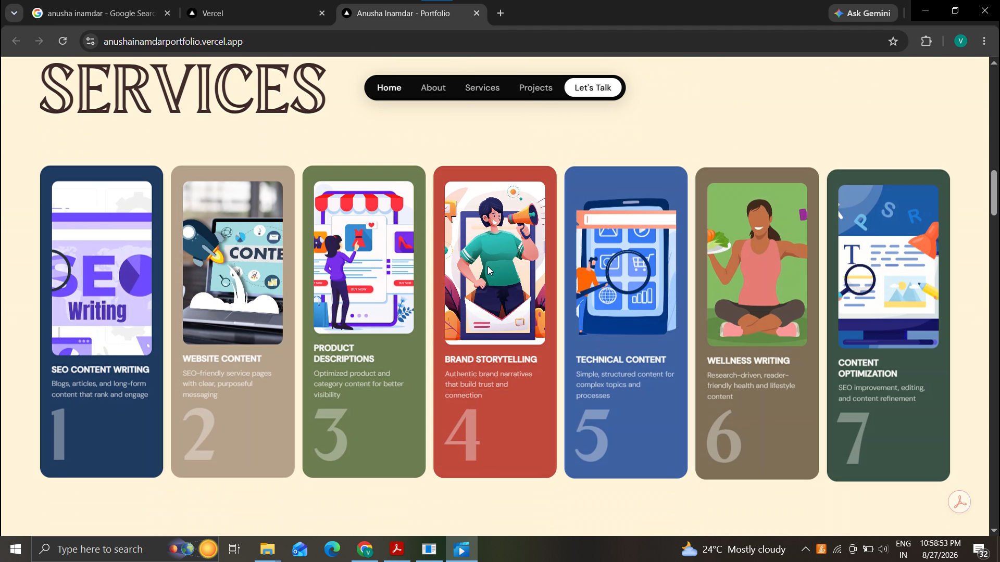
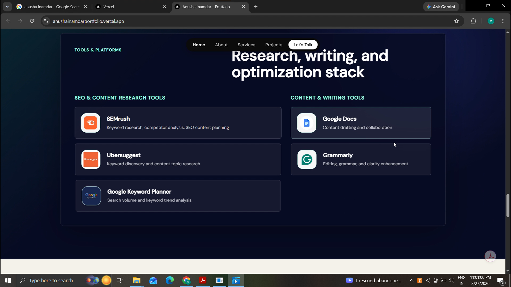
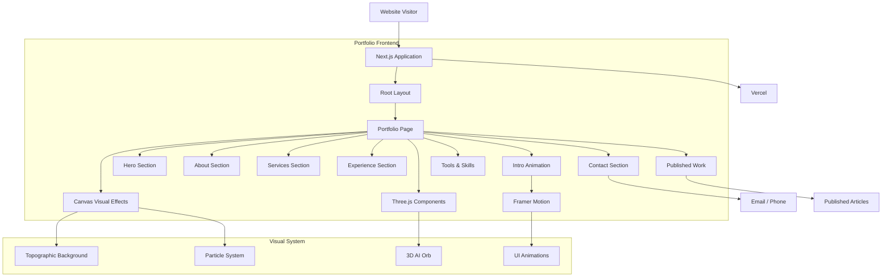

<div align="center">


# Anusha Inamdar Portfolio

**SEO Content Writer & Strategist — Personal Portfolio**

A modern, interactive, and high-performance portfolio built to showcase 610+ published articles, SEO expertise, professional experience, services, research tools, and published work across multiple industries.

[](https://nextjs.org/)
[](https://react.dev/)
[](https://www.framer.com/motion/)
[](https://threejs.org/)
[](https://developer.mozilla.org/en-US/docs/Web/CSS)
[](https://vercel.com/)

[Overview](#overview) • [Screenshots](#screenshots) • [Features](#features) • [Architecture](#architecture) • [Tech Stack](#tech-stack) • [Getting Started](#getting-started) • [Project Structure](#project-structure) • [Deployment](#deployment)

</div>

---

## Overview

The **Anusha Inamdar Portfolio** is a modern personal branding website designed for **Anusha Inamdar**, an SEO Content Writer and Strategist.

The portfolio combines professional content presentation with interactive visual experiences to showcase her writing expertise, published work, professional experience, services, tools, and achievements.

The application focuses on creating a premium digital presence through **Next.js, React, Framer Motion, Three.js, HTML5 Canvas, and custom CSS animations**.

The live portfolio is deployed on Vercel.

**Live Website:**
https://anushainamdarportfolio.vercel.app/

---

## Screenshots

<table>
  <tr>
    <td align="center"><strong>Portfolio Landing Page</strong></td>
    <td align="center"><strong>Services</strong></td>
  </tr>
  <tr>
    <td></td>
    <td></td>
  </tr>
  <tr>
    <td align="center"><strong>Expertise</strong></td>

  </tr>
  <tr>
    <td></td>

  </tr>
</table>

---

## Features

### Modern Visual Design

The portfolio uses a custom visual system designed around a premium editorial and technology-inspired aesthetic.

* Interactive topographic background
* Dynamic particle effects
* Glassmorphism UI components
* Fluid typography
* Custom CSS animations
* Smooth section transitions
* Interactive 3D visual elements
* Animated introduction sequence

### Responsive Design

The website is designed to provide a consistent experience across different screen sizes.

* Mobile-first responsive layout
* Desktop and tablet optimization
* Adaptive typography
* Responsive navigation
* Mobile menu animations
* Flexible content layouts

### Interactive Project Showcase

The portfolio provides an interactive showcase of published content across different platforms and industries.

Featured work includes content published for:

* Velocity Express
* The Desi Food
* Omnity
* OLRAA

Users can explore published articles and understand the range of industries covered.

### Professional Experience

The portfolio highlights professional achievements and measurable content production results.

Key metrics include:

* 610+ SEO-optimized pages published
* SEO content across multiple industries
* Search visibility-focused content strategies
* Logistics, wellness, lifestyle, and e-commerce experience

### Services Showcase

The portfolio presents the major content services offered, including:

* SEO Content Writing
* Website Content
* Product Descriptions
* Brand Storytelling
* Technical Content
* Wellness Writing
* Content Optimization

### Tools & Research Stack

The portfolio showcases the professional tools used for research, SEO, writing, and content optimization.

* SEMrush
* Ubersuggest
* Google Keyword Planner
* Grammarly
* Google Docs

### Direct Contact

The contact section provides direct communication options for potential clients and collaborators.

* Email contact
* Phone contact
* Client inquiry interface
* Quick-access contact actions

---

## Architecture



---

## Application Flow

```text
User
  |
  v
Portfolio Landing Page
  |
  +----------------------+
  |                      |
  v                      v
Visual Experience     Content Sections
  |                      |
  |                      +--> About
  |                      +--> Services
  |                      +--> Experience
  |                      +--> Published Work
  |                      +--> Tools
  |                      +--> Contact
  |
  +--> Topographic Canvas
  +--> Particle Effects
  +--> 3D Orb
  +--> Intro Animation
  |
  v
Client Interaction
  |
  +--> Published Articles
  +--> Email
  +--> Phone
```

---

## Tech Stack

### Framework

**[Next.js 16](https://nextjs.org/)**

Used as the primary application framework with the App Router architecture.

Responsibilities include:

* Application routing
* Page rendering
* Metadata
* Component architecture
* Production optimization

### Frontend

**[React 19](https://react.dev/)**

Used to build reusable and interactive UI components throughout the portfolio.

### Animation

**[Framer Motion](https://www.framer.com/motion/)**

Used for:

* Page transitions
* Component animations
* Scroll-based effects
* Menu transitions
* Interactive UI elements
* Intro animations

### Visual Effects

**[Three.js](https://threejs.org/)**

Used for interactive 3D visual components including the AI orb and other visual effects.

**HTML5 Canvas**

Used for:

* Topographic background
* Particle effects
* Interactive background elements

### Styling

**Vanilla CSS3**

The application uses a custom CSS design system with:

* CSS variables
* Responsive layouts
* Fluid typography
* Keyframe animations
* Glassmorphism
* Custom visual effects

### Theme Management

**[next-themes](https://github.com/pacocoursey/next-themes)**

Used for theme management and interface appearance control.

---

## Design System

The portfolio's visual identity is built around several major design principles.

| Component          | Purpose                               |
| ------------------ | ------------------------------------- |
| Topographic Canvas | Dynamic background visual             |
| Particle System    | Adds depth and motion                 |
| Glassmorphism      | Modern UI surface treatment           |
| 3D Orb             | Interactive visual identity           |
| Fluid Typography   | Responsive editorial presentation     |
| Motion System      | Smooth page and component transitions |
| CSS Variables      | Centralized design control            |

The combination of these systems creates a visual style that blends **editorial portfolio design with modern interactive web experiences**.

---

## Project Structure

```text
portfolio-ui/
│
├── app/
│   │
│   ├── components/
│   │   ├── IntroAnimation.js
│   │   ├── Topobackground.js
│   │   ├── Particles.js
│   │   ├── EduSlideshow.js
│   │   ├── AiOrb.js
│   │   └── AIThinkingOrb.js
│   │
│   ├── globals.css
│   ├── layout.js
│   └── page.js
│
├── public/
│   ├── images/
│   ├── logos/
│   ├── icons/
│   └── other static assets
│
├── screenshots/
│   ├── home.png
│   ├── about.png
│   ├── services.png
│   └── projects.png
│
├── package.json
├── package-lock.json
├── next.config.js
├── .gitignore
└── README.md
```

---

## Getting Started

### Prerequisites

Make sure the following are installed:

* **Node.js 18+**
* **npm**
* Git

Verify Node.js:

```bash
node --version
```

Verify npm:

```bash
npm --version
```

---

### 1. Clone the Repository

```bash
git clone https://github.com/vedantkalkundri-ops/portfolio-ui.git

cd portfolio-ui
```

---

### 2. Install Dependencies

```bash
npm install
```

---

### 3. Start Development Server

```bash
npm run dev
```

The development server will start at:

```text
http://localhost:3000
```

Open the URL in a modern web browser.

---

## Available Scripts

### Development

```bash
npm run dev
```

Starts the Next.js development server with hot reloading.

### Production Build

```bash
npm run build
```

Creates an optimized production build.

### Production Server

```bash
npm run start
```

Starts the application using the production build.

### Lint

```bash
npm run lint
```

Runs ESLint checks across the project.

---

## Deployment

The portfolio is deployed using **[Vercel](https://vercel.com/)**.

### Production Deployment

The application can be deployed directly through Vercel by connecting the GitHub repository.

Typical deployment flow:

```text
GitHub Repository
       |
       v
     Vercel
       |
       v
Next.js Build
       |
       v
Production Website
```

### Live Portfolio

**https://anushainamdarportfolio.vercel.app/**

---

## Performance

The application is designed with performance and modern web standards in mind.

Key considerations include:

* Next.js production optimization
* Component-based React architecture
* Optimized static assets
* Responsive CSS
* Client-side animation management
* Efficient Canvas rendering
* Production deployment through Vercel

---

## Security

This portfolio is primarily a client-side presentation website and does not require a traditional backend database.

Recommended practices for future development include:

* Avoid exposing API keys in client-side code
* Store environment variables securely
* Validate external links
* Optimize and sanitize user-provided contact inputs if a backend is introduced
* Keep dependencies updated
* Avoid storing sensitive personal information in frontend source code

---

## Future Improvements

Potential enhancements include:

* CMS integration for managing published articles
* Dynamic blog section
* Advanced SEO metadata management
* Contact form with server-side processing
* Analytics dashboard
* Content filtering by industry
* Searchable article portfolio
* More interactive 3D experiences
* Accessibility improvements
* Performance monitoring

---

## Author & Credits

### Content & Profile

**Anusha Inamdar**

SEO Content Writer & Strategist

### Development

Designed and developed as a modern personal branding portfolio using **Next.js, React, Framer Motion, Three.js, and custom CSS**.

---


<div align="center">

**A client Work**

</div>
